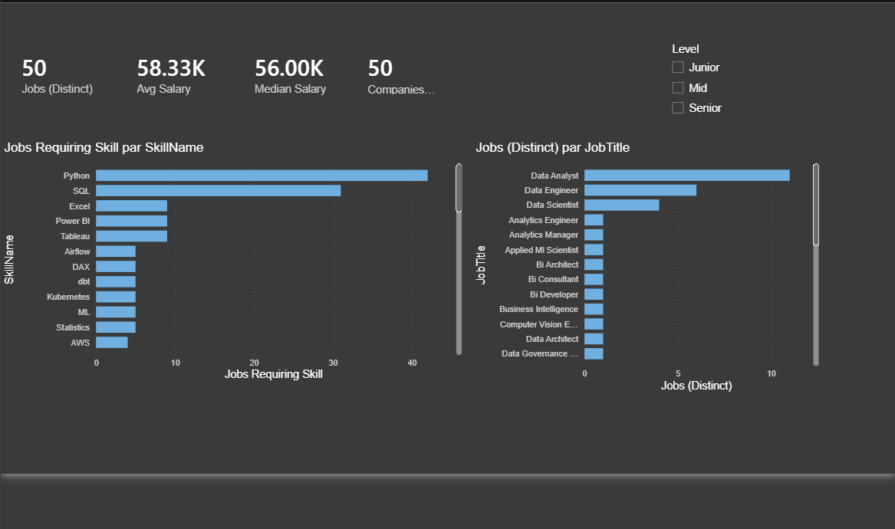
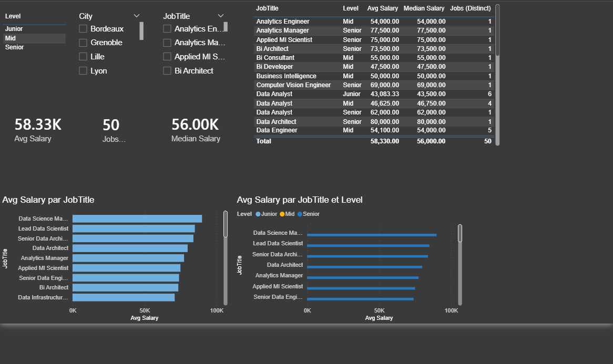

# 📊 Power BI – Data & Tech Job Market Analysis

## 📌 Project Overview
This project analyzes the Data & Technology job market using an interactive **Power BI dashboard**.
The goal is to identify:
- in-demand roles
- key technical skills
- salary distributions
- trends over time

## 🧰 Tools & Technologies
- Power BI Desktop
- Power Query (data cleaning & transformation)
- DAX (measures & KPIs)
- Data modeling (fact & dimension tables, many-to-many relationships)

## 📂 Dataset
Public job postings dataset (CSV format), cleaned and modeled inside Power BI.

## 📊 Dashboard Pages

### 1️⃣ Overview

Key KPIs:
- Number of job postings
- Average & median salary
- Distribution by role, location, and experience level

---

### 2️⃣ Salaries & Roles

Comparison of salaries across:
- job titles
- experience levels
- locations

---

### 3️⃣ Skills Analysis

Analysis of:
- most demanded skills
- skill categories (Programming, Cloud, BI, ML, etc.)
- skill share across job postings

---

### 4️⃣ Market Trends

Time-based analysis:
- job postings evolution
- salary trends
- quarterly demand changes

## 📥 How to Use
1. Download the `.pbix` file
2. Open it with **Power BI Desktop**
3. Interact with filters and slicers to explore the data

## 💡 Key Insights
- Data Engineer and ML roles show higher average salaries
- Python and SQL appear in the majority of job postings
- Senior roles demonstrate significant salary growth over junior levels

## 👤 Author
Nolan Berthe
